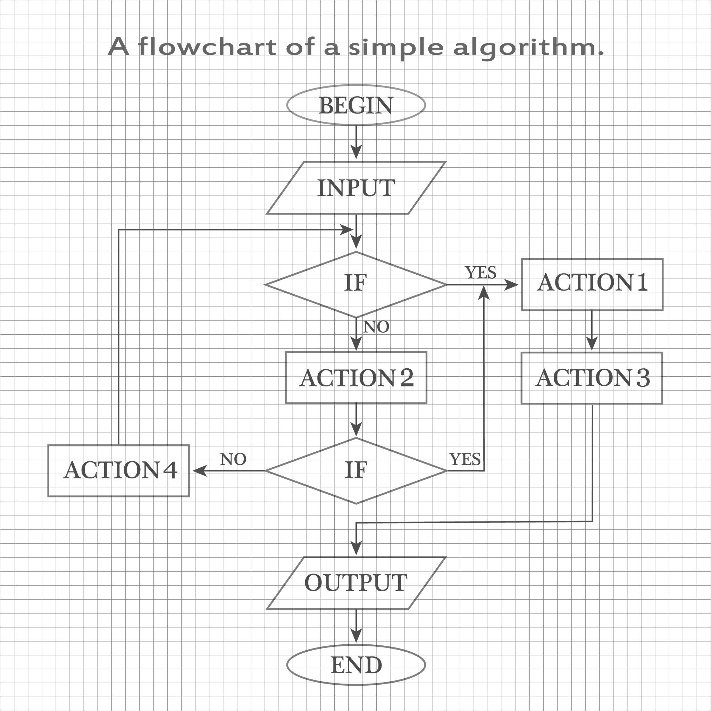

# Module 1: Introduction to Computing & Python

> **Lesson Goal:** By the end of this module, students should understand what programming means, what Python is used for, how to install Python, how to set up a coding environment, how to write their first script, and how to identify basic errors.

---

## 1. What is Programming?

Programming is the process of giving instructions to a computer so that it can perform specific tasks.

Think of a computer as a very intelligent but obedient machine. It can do almost anything, but only if you tell it exactly what to do.
 


For example, a computer can:

* Open a web page
* Calculate a student's result
* Send an email
* Build a website
* Analyze business data

All these tasks are possible because programmers write instructions called **code**.


**Figure 1:** Programming follows a simple pattern: the computer receives input, processes it, and gives output.

### Real-Life Example

Imagine you want to make a cup of tea.

The steps might be:

1. Boil water
2. Put tea bag in cup
3. Pour hot water
4. Add sugar
5. Stir

These instructions are called an **algorithm**.

In programming, we write similar instructions for computers.


 

**Figure 2:** An algorithm is a step-by-step process for solving a problem.


### Who is a Programmer?

A programmer is someone who writes code to solve problems using a computer.

Examples of programmers include:

* Web Developers
* Software Engineers
* Data Scientists
* AI Engineers
* Cybersecurity Experts

---

## 2. What is Python?

Python is a high-level programming language. A programming language is a language humans use to give instructions to computers.

Python is one of the most popular programming languages because it is:

* Easy to learn
* Easy to read
* Powerful
* Flexible
* Useful in many career paths

### Why Learn Python?

Python is beginner-friendly because its syntax looks similar to plain English.

Example:

```python
print("Hello World")
```

Even without programming knowledge, most people can guess that this code prints **Hello World** on the screen.

+%E2%86%92+Hello+World)

**Figure 3:** Python code is usually easy to read and understand.

### Companies and Products That Use Python

Python is used by many technology companies and products in areas like search engines, social media, automation, data analysis, and artificial intelligence.

Examples include:

* Google
* Netflix
* Instagram
* Spotify
* Dropbox

---

# 3. Python Use Cases

Instead of only listing AI, Web, Data Science, etc., show examples visually.


<!-- 


 -->

Explain:

* AI → ChatGPT-like systems
* Web → Websites and APIs
* Data → Analytics dashboards
* Automation → Repetitive task automation

## A. Artificial Intelligence (AI)

Python is widely used for AI and Machine Learning.

Examples:

* Chatbots
* Recommendation systems
* Face recognition
* Voice assistants

Real-life examples include:

* ChatGPT-like systems
* Siri-like assistants
* Netflix-style recommendations

---

## B. Web Development

Python is used to build websites and web applications.

Popular Python web frameworks include:

* Django
* Flask
* FastAPI

Examples of web applications:

* E-commerce platforms
* School portals
* Banking systems
* Hospital management systems

---

## C. Cybersecurity

Python helps cybersecurity professionals automate security tasks.

Examples:

* Network scanning
* Log analysis
* Password checking
* Security monitoring

---

## D. Data Analysis

Organizations collect large amounts of data every day. Python helps analyze data and discover useful insights.

Examples:

* Sales reports
* Financial analysis
* Student performance analysis
* Customer behavior analysis

---

## E. Automation

Python can automate repetitive tasks.

Examples:

* Sending emails automatically
* Renaming files
* Generating reports
* Updating spreadsheets

Automation saves time and reduces human error.

---

# 4. Installing Python

Before writing Python programs, we must install Python on our computer.

**Figure 5:** Python installation follows four basic steps.

## Step 1: Visit the Python Website

Go to:

https://www.python.org


**Figure 6:** Open the official Python website and locate the download section.

## Step 2: Download Python

Choose the latest stable version.

Example:

Python 3.x


**Figure 7:** Download the correct Python version for your operating system.

## Step 3: Run the Installer

During installation, make sure you check:

☑ **Add Python to PATH**

This is very important because it allows your computer to recognize Python from the command line.

Then click:

**Install Now**


**Figure 8:** Beginners often forget this step. Always tick **Add Python to PATH** before installing.

## Step 4: Verify Installation

Open Command Prompt on Windows or Terminal on Mac.

Type:

```bash
python --version
```

or

```bash
python3 --version
```

You should see something like:

```bash
Python 3.13.0
```

This confirms successful installation.


**Figure 9:** If Python is installed correctly, the terminal will display the installed Python version.

---

# 5. Introduction to Jupyter Notebook

Jupyter Notebook is a tool that allows us to write and run Python code inside a web browser.

It is widely used for:

* Learning Python
* Data Science
* Machine Learning
* Research

### Advantages

* Easy to use
* Interactive
* Supports text and code together
* Excellent for beginners

### Example

```python
print("Welcome to Python")
```

The output appears immediately below the code.

%0AOutput%3A+Welcome+to+Python)

**Figure 10:** Jupyter Notebook allows students to write code and see the result immediately.

---

# 6. Setting Up IDEs

## What is an IDE?

IDE means:

**Integrated Development Environment**

An IDE is software that helps programmers write code more efficiently.

Think of it as a digital workspace for programmers.


**Figure 11:** An IDE combines the tools a programmer needs in one workspace.

---

## A. Visual Studio Code (VS Code)

VS Code is recommended for beginners.

Advantages:

* Free
* Fast
* Lightweight
* Supports many programming languages
* Has many useful extensions

### Installation

1. Download VS Code
2. Install the Python extension
3. Create a Python file
4. Start coding


**Figure 12:** VS Code is a good beginner-friendly editor for Python.

---

## B. PyCharm

PyCharm is a professional Python IDE.

Advantages:

* Excellent debugging tools
* Smart code suggestions
* Great for large projects

Disadvantages:

* Uses more computer memory
* Slightly harder for beginners

---

## C. Jupyter Notebook

Jupyter Notebook is best for:

* Learning
* Experimenting
* Data Science

It is not ideal for building large software projects.


---

# 7. Writing Your First Python Script

The traditional first program is called:

**Hello World**

Create a file named:

```python
hello.py
```

Write:

```python
print("Hello World")
```

Run it.

Output:

```text
Hello World
```

Congratulations! You have written your first Python program.


**Figure 13:** The first script teaches students how to create, write, run, and view program output.

---

# 8. Understanding Python Execution Flow

Execution flow means the order in which Python executes code.

Python executes code from top to bottom.

Example:

```python
print("Step 1")
print("Step 2")
print("Step 3")
```

Output:

```text
Step 1
Step 2
Step 3
```

Python follows the instructions exactly in the order they appear.


**Figure 14:** Python reads code line by line from top to bottom.

### Another Example

```python
name = "Adewale"
print(name)
print("Welcome")
```

Output:

```text
Adewale
Welcome
```

Python reads line by line from top to bottom.

---

# 9. Understanding Errors and Debugging Basics

Errors happen when Python cannot understand or execute our code.

Making mistakes is normal. Even experienced developers make mistakes every day.

The important skill is learning how to find and fix them.

This process is called:

**Debugging**

---

## Common Error 1: Syntax Error

A syntax error happens when Python cannot understand the structure of your code.

Example:

```python
print("Hello World"
```

Output:

```text
SyntaxError
```

Cause:

Missing closing bracket.

Correct version:

```python
print("Hello World")
```

---

## Common Error 2: Name Error

A name error happens when you try to use something that has not been created yet.

Example:

```python
print(age)
```

Output:

```text
NameError
```

Cause:

The variable `age` does not exist.

Correct version:

```python
age = 25
print(age)
```

---

## Common Error 3: Type Error

A type error happens when Python cannot perform an operation on incompatible data types.

Example:

```python
"10" + 5
```

Output:

```text
TypeError
```

Cause:

Python cannot add text and numbers together.

Correct version:

```python
int("10") + 5
```

Output:

```text
15
```

---

## Debugging Tips

1. Read error messages carefully.
2. Check spelling mistakes.
3. Verify brackets are closed.
4. Check indentation.
5. Test code in small parts.
6. Use `print()` statements to inspect values.

Remember:

Every programmer spends a large part of their career fixing errors.

Debugging is not a sign of failure; it is part of programming.

---

# Class Practical Activities

## Practical 1: Print Your Details

Write a program that prints your name, age, school, and career goal.

Example:

```python
print("Name: Adewale")
print("Age: 25")
print("Career Goal: Software Engineer")
```

## Practical 2: Hello Python

Write a program that displays:

```text
Welcome to Python Programming
```

## Practical 3: Identify the Error

Find and correct the error in this code:

```python
print("I am learning Python"
```

---

# Module Summary

At the end of this lesson, you should be able to:

✓ Explain what programming is

✓ Describe Python and its applications

✓ Install Python successfully

✓ Set up VS Code and Jupyter Notebook

✓ Write your first Python program

✓ Understand how Python executes code

✓ Identify common programming errors

✓ Apply basic debugging techniques

Programming is simply solving problems by giving clear instructions to a computer. Python makes that process easier because of its simple and readable syntax.
