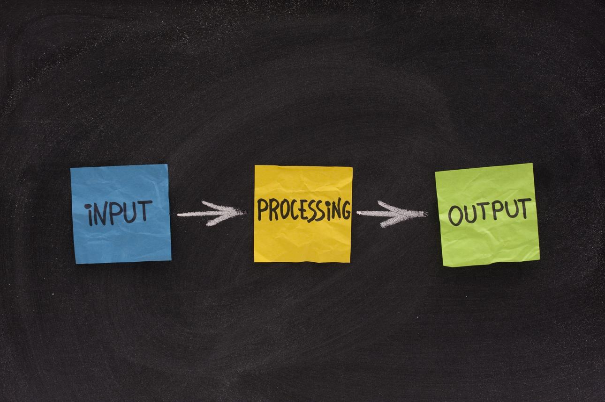

# Module 1: Introduction to Computing & Python

## 1. What is Programming?

Programming is the process of giving instructions to a computer so that it can perform specific tasks.

Think of a computer as a very intelligent but obedient machine. It can do almost anything, but only if you tell it exactly what to do.

For example:

* Open a web page
* Calculate a student's result
* Send an email
* Build a website
* Analyze business data

All these tasks are possible because programmers write instructions called **code**.

### Real-Life Example

Imagine you want to make a cup of tea.

The steps might be:

1. Boil water
2. Put tea bag in cup
3. Pour hot water
4. Add sugar
5. Stir

These instructions are called an **algorithm**.

In programming, we write similar instructions for computers.

### Who is a Programmer?

A programmer is someone who writes code to solve problems using a computer.

Examples:

* Web Developers
* Software Engineers
* Data Scientists
* AI Engineers
* Cybersecurity Experts

---

## 2. What is Python?

Python is a high-level programming language created by Guido van Rossum and first released in 1991.

It is one of the most popular programming languages in the world because it is:

* Easy to learn
* Easy to read
* Powerful
* Flexible
* Used by major companies worldwide

### Why Learn Python?

Python is beginner-friendly because its syntax looks similar to plain English.

Example:

```python
print("Hello World")
```

Even without programming knowledge, most people can guess what this code does.

### Companies Using Python

* Google
* Netflix
* Instagram
* Spotify
* Dropbox

---

# 3. Python Use Cases

Python can be used in many industries.

## A. Artificial Intelligence (AI)

Python is the most popular language for AI and Machine Learning.

Examples:

* Chatbots
* Recommendation systems
* Face recognition
* Voice assistants

Examples include:

* ChatGPT
* Siri
* Netflix recommendations

---

## B. Web Development

Python is used to build websites and web applications.

Frameworks:

* Django
* Flask
* FastAPI

Examples:

* E-commerce platforms
* School portals
* Banking systems
* Hospital management systems

---

## C. Cybersecurity

Python helps security professionals automate security tasks.

Examples:

* Network scanning
* Log analysis
* Password auditing
* Security monitoring

---

## D. Data Analysis

Organizations collect large amounts of data daily.

Python helps analyze data and discover useful insights.

Examples:

* Sales reports
* Financial analysis
* Student performance analysis
* Customer behavior analysis

---

## E. Automation

Python can automate repetitive tasks.

Examples:

* Sending emails automatically
* Renaming files
* Generating reports
* Updating spreadsheets

Automation saves time and reduces human error.

---

# 4. Installing Python

Before writing Python programs, we must install Python on our computer.

## Step 1: Visit the Python Website

Go to:

https://www.python.org

## Step 2: Download Python

Choose the latest stable version.

Example:

Python 3.x

## Step 3: Run the Installer

During installation:

✓ Check:

"Add Python to PATH"

This is very important.

Then click:

"Install Now"

## Step 4: Verify Installation

Open Command Prompt (Windows) or Terminal (Mac).

Type:

```bash
python --version
```

or

```bash
python3 --version
```

You should see something like:

```bash
Python 3.13.0
```

This confirms successful installation.

---

# 5. Introduction to Jupyter Notebook

Jupyter Notebook is a tool that allows us to write and run Python code inside a web browser.

It is widely used for:

* Learning Python
* Data Science
* Machine Learning
* Research

### Advantages

* Easy to use
* Interactive
* Supports text and code together
* Excellent for beginners

### Example

```python
print("Welcome to Python")
```

The output appears immediately below the code.

---

# 6. Setting Up IDEs

## What is an IDE?

IDE means:

Integrated Development Environment

An IDE is software that helps programmers write code more efficiently.

Think of it as a digital workspace for programmers.

---

## A. Visual Studio Code (VS Code)

Recommended for beginners.

Advantages:

* Free
* Fast
* Lightweight
* Supports many programming languages
* Large extension marketplace

### Installation

1. Download VS Code
2. Install Python extension
3. Create a Python file
4. Start coding

---

## B. PyCharm

A professional Python IDE.

Advantages:

* Excellent debugging tools
* Smart code suggestions
* Great for large projects

Disadvantages:

* Uses more memory
* Slightly harder for beginners

---

## C. Jupyter Notebook

Best for:

* Learning
* Experimenting
* Data Science

Not ideal for building large software projects.

---

# 7. Writing Your First Python Script

The traditional first program is called:

"Hello World"

Create a file named:

```python
hello.py
```

Write:

```python
print("Hello World")
```

Run it.

Output:

```text
Hello World
```

Congratulations!

You have written your first Python program.

---

# 8. Understanding Python Execution Flow

Execution flow means the order in which Python executes code.

Python executes code from top to bottom.

Example:

```python
print("Step 1")

print("Step 2")

print("Step 3")
```

Output:

```text
Step 1
Step 2
Step 3
```

Python follows the instructions exactly in the order they appear.

### Another Example

```python
name = "Adewale"

print(name)

print("Welcome")
```

Output:

```text
Adewale
Welcome
```

Python reads line by line from top to bottom.

---

# 9. Understanding Errors and Debugging Basics

Errors happen when Python cannot understand or execute our code.

Making mistakes is normal.

Even experienced developers make mistakes every day.

The important skill is learning how to find and fix them.

This process is called:

**Debugging**

---

## Common Error 1: Syntax Error

Example:

```python
print("Hello World"
```

Output:

```text
SyntaxError
```

Cause:

Missing closing bracket.

Correct Version:

```python
print("Hello World")
```

---

## Common Error 2: Name Error

Example:

```python
print(age)
```

Output:

```text
NameError
```

Cause:

Variable does not exist.

Correct Version:

```python
age = 25

print(age)
```

---

## Common Error 3: Type Error

Example:

```python
"10" + 5
```

Output:

```text
TypeError
```

Cause:

Python cannot add text and numbers together.

Correct Version:

```python
int("10") + 5
```

Output:

```text
15
```

---

## Debugging Tips

1. Read error messages carefully.
2. Check spelling mistakes.
3. Verify brackets are closed.
4. Check indentation.
5. Test code in small parts.
6. Use print() statements to inspect values.

Remember:

Every programmer spends a large part of their career fixing errors.

Debugging is not a sign of failure; it is part of programming.

---

# Module Summary

At the end of this lesson, you should be able to:

✓ Explain what programming is

✓ Describe Python and its applications

✓ Install Python successfully

✓ Set up VS Code and Jupyter Notebook

✓ Write your first Python program

✓ Understand how Python executes code

✓ Identify common programming errors

✓ Apply basic debugging techniques

Programming is simply solving problems by giving clear instructions to a computer. Python makes that process easier because of its simple and readable syntax.
